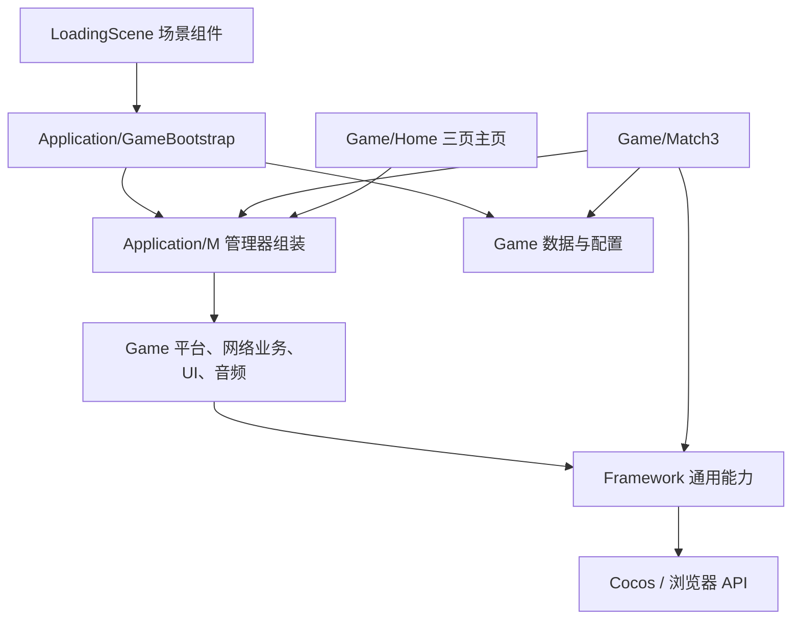

# 项目架构与代码维护地图

更新：2026-10-03。本文对应整理后的实际目录；换皮方案与历史问题分析见其他专题文档。

## 1. 分层原则



实际依赖约束：

- **Framework 不引用 Application、Game、Debug。** `npm run check:architecture` 自动检查。
- Application 负责启动和组装；业务代码暂时仍通过 `M` 取得共享服务。因此 Application 与 Game 并非完全单向依赖。
- Game 内按玩法组织；`Common` 是多个业务共用的代码，仍包含三消和引导知识，不能直接当通用框架复制到别的游戏。
- 现有模型使用 `cc.Vec2`、全局运行状态和事件；这次保留模型规则，没有将其重写为与引擎无关的纯逻辑库。

## 2. 框架代码

根目录：`assets/Script/Framework/`。

| 子目录／入口 | 职责 | 使用边界 |
| --- | --- | --- |
| `Events/EventMgr.ts` | 注册、发送和解绑事件 | 不定义玩法事件，玩法事件名由 Game 提供 |
| `Pool/DataPool.ts` | 普通对象回收 | 对象实现现有 `destory()` 接口 |
| `Pool/NodePoolMgr.ts` | Cocos 节点池 | 玩法负责何时归还和清理 |
| `Network/HttpRequest.ts`、`Socket.ts` | HTTP、Socket 传输 | 不包含登录、支付、关卡结算接口 |
| `Network/Sequence.ts`、`NetBase.ts` | 现有序列／传输基类 | 保留原 API 以兼容调用方 |
| `Resources/CacheMgr.ts` | 监测公开资源缓存数量并回调告警 | 不再替换 `cc.loader._cache`，不直接定义业务事件 |
| `Async/withTimeout.ts` | 超时兜底和迟到结果处理 | 超时只停止等待，不取消底层请求 |
| `Utils/Util.ts`、`NumberUtils.ts`、`RoadUtil.ts` | 工具方法 | 新方法不得引入玩法依赖 |
| `Utils/LRUCache.ts`、`SingletonFactory.ts` | 缓存容器和单例工厂 | 与业务无关 |
| `Utils/Log.ts` | 日志 | 开关由 `FrameworkOptions` 注入 |
| `Components/` | 滑动按钮、遮罩、Spine 播放等 | 带业务音效的 Button 位于 Game |
| `Shader/` | Shader 组件 | 运行时按需加载 effect；构建导入时不加载资源 |
| `FrameworkOptions.ts` | 日志／网络策略回调 | Application/Apps 设置具体开关 |

缓存监测每秒最多检查一次。超过 300 个资源且数量增长时，应用层将告警转换成原 `Event.System.CacheWarning`，继续触发原 UI 缓存清理流程。

## 3. 应用启动

根目录：`assets/Script/Application/`。

| 文件 | 职责 |
| --- | --- |
| `Apps.ts` | 版本、调试、网络与 GM 开关；向框架注入策略 |
| `M.ts` | 组装共享管理器、设置缓存告警；重复 init 不重复组装 |
| `GameBootstrap.ts` | 平台初始化、登录、本地用户兜底、表加载；共享同一次启动 Promise |
| `Loading/LoadingScene.ts` | 进度展示、资源／场景预加载、跳转 HomeScene |

启动顺序：

1. `LoadingScene.onLoad()` 调用 `GameBootstrap.run()`。
2. `M.init()` 组装服务，同时启动本地表加载。
3. 初始化平台，等待登录，3 秒后允许本地兜底。
4. `RuntimeMgr.initRemotData()` 初始化玩家数据。
5. 等待同一批配置表，最多等待 5 秒；失败记录原因。
6. Loading 预加载共用 UI 和 HomeScene 场景，同时请求可选每日任务。
7. 进入主页中间的关卡列表，由开始按钮进入当前关卡；调试菜单提供内存特殊元素与结算验收关，不改变正式关卡配置。
8. 关卡设置的退出按钮返回 HomeScene，重开按钮仍重开当前关卡。

`settings/builder.json` 的启动场景已由 HotelScene 修正为 LoadingScene。此前直接发布会绕过这个启动流程。

每日任务失败不会阻塞主玩法。`GameBootstrap` 初始化抛错时允许下次重试；使用兜底成功进入游戏后，不会自动重新登录。

## 4. 业务模块

根目录：`assets/Script/Game/`。

| 模块 | 职责 | 主要入口 |
| --- | --- | --- |
| `Match3/` | 三消局内玩法 | `MainCtrl.ts`、`Model/GameModel.ts` |
| `Data/` | 当前玩家、货币、局内运行状态、常量、关卡接口 | `RuntimeMgr.ts`、`StorageMgr.ts`、`MoneyManager.ts` |
| `Config/` | 表结构、表加载与业务资源路径 | `GameTableMgr.ts`、`Paths.ts`、`Tables/`、`Loader/` |
| `Common/` | 业务公共方法、音频、动画、弹窗 | `Common.ts`、`AudioCtrl.ts`、`UI/UIMgr.ts`、`UI/UIBase.ts` |
| `Services/` | 登录和业务请求、任务、分享、上报 | `NetMgr.ts`、`DailyTaskMgr.ts`、`ShareMgr.ts`、`ReportMgr.ts` |
| `Platform/` | 微信／浏览器适配和设备信息 | `PlatformMgr.ts`、`Adapters/Wechat.ts`、`Adapters/Webapp.ts` |
| `Views/` | 奖励、GM、道具掉落视图 | `GMView.ts` |
| `Home/` | 商店／关卡／图鉴、页签和左右滑动、金币购买 | `HomeScene.ts`、`HomeNavigation.ts`、`LobbyCatalog.ts` |

平台适配器目前使用玩家状态、业务地址和登录服务，因此归到 Game；以后要跨游戏复用，应先抽出明确的接口。

### 4.1 三消调用链

```text
MainCtrl.onLoad
  → M.init（已初始化时直接返回）
  → initGame
      → Level.getLvCfgData          选择并读取关卡
      → Match3Skin.load             棋盘皮肤
      → ResCtrl.load                棋子、障碍和收集图标
      → MainUiCtrl                  HUD、步数、目标和道具
      → GameModel                   构建棋盘、初始化目标
      → Ground / BasicCell / UpGround 视图层
  → 输入、交换、消除、掉落、目标更新
  → 胜负判断和结算 UI
```

维护时按问题定位：

- 交换、消除、掉落、地图生成：`Model/GameModel.ts`、`CellModel.ts`。
- 特殊棋子和组合：`Model/BombModel.ts`。
- 地板和上层障碍：`GroundCellModel.ts`、`UpGroundCellModel.ts`。
- 多格障碍、海龟／螃蟹等：`Model/multipleGridCol/`。
- 蘑菇、传送带、角色插件：`Model/SpecialPlug/`。
- 任务、锁和旋转过程：`Control/`。
- 棋子外观：`View/ItemBasicCellCtrl.ts`；资源映射：`ResCtrl.ts`。
- 棋盘皮肤与边框：`Skin/Match3Skin.ts`、`View/GroundViewCtrl.ts`。
- 步数、目标、道具展示：`View/UI/`。

### 4.2 表与资源配置

- `Config/Loader/BytesTable.ts` 负责本地 `resources/csv/` 表加载。原代码硬编码选择本地表；本次保留这一有效行为。
- `BaseTable.ts` 负责主键索引和行对象转换，`setData()` 用于独立下载的每日任务表。
- `GameTableMgr.execute()` 并行等待表加载，共享在途 Promise，失败后释放状态以便重试；删除了 10 毫秒无限轮询。
- 关卡 JSON 仍由 `Data/Interface/Level.ts` 读取，字段定义在 `Interface/Level/ILevel.ts`。
- `match3_skin/default.json`、`match3_res/default.json` 控制主题资源；序号、CellType 值和旧存档字段保持原样。

### 4.3 UI 与引导

酒店、海岛、旧选关地图和 GodGuide 全局引导已退役。UIBase 不再连接旧经营引导，局内 Match3TutorialCtrl 与关卡 Tutorial 配置仍保留。

## 5. 迁移规则和维护约定

旧目录对应关系：

| 原位置 | 现在的位置 |
| --- | --- |
| `Base/Manager/M.ts`、`Base/Apps.ts` | `Application/` |
| `Logic/Loading/` | `Application/Loading/` |
| `Base/Tabls/` | `Game/Config/Tables/` |
| `Base/Manager/Table/` | `Game/Config/Loader/` |
| `Base/Manager/Plaform/` | `Game/Platform/Adapters/` |
| `Base/Manager/NetMgr.ts` 等业务管理器 | `Game/Services/` |
| `Base/UI/`、业务 UI 管理器 | `Game/Common/UI/` |
| `Base` 中通用事件、池、传输和工具 | `Framework/` 对应子目录 |
| `Logic/` 中各玩法和数据 | `Game/` |
| `Views/` | `Game/Views/` |
| `GodGuide/*.ts` | 已退役，见退役清单 |
| `Libs/` | `ThirdParty/` |

首次迁移映射和原 UUID 见 `source-migration.json`；后续删除以 `retired-hotel-island.json` 为准。检查器同时验证保留脚本 UUID 和退役文件不存在。特殊元素的旧资源退役见 `retired-special-art.json`；共享美术仍保留。

新增代码后运行 `npm run check`。修改脚本装饰器、继承关系、资源加载或启动链时，还需要 Cocos 构建和浏览器／目标设备验证；仅 TypeScript 通过不能证明组件能被引擎注册。

## 6. 后续可继续拆分的部分

- `MainCtrl` 和 `GameModel` 仍然较大；下一步可按输入、棋盘推进、结算拆分，但必须配套实际关卡回归。
- `RuntimeMgr` 与 `Common` 仍承载多个业务职责。
- `M.changeScene()` 和拼写为 `destory()` 的旧入口仍有历史空实现。不要假定它们已经管理完整的场景／应用生命周期。
- 主页已确定为商店、游戏、图鉴。共享程序 UI 在 `Game/Common/UI/ForestUI.ts`；个人信息、设置、暂停和购买弹窗在 `PlayerPanels.ts`。图鉴名称与资料仍待作者提供。

## 7. 特殊元素表现层

棋盘通过 `SpecialPieceArt` 获取共用纹理，`SpecialEffects` 负责程序图形和有上限的视觉节点池，`EffectTimeline` 统一管理完成与取消。`EffLayerCtrl` 保留原业务入口，`BombModel` 继续决定消除范围和组合规则。`MainCtrl.removeCurrentGame` 在销毁旧棋盘前取消未完成效果，场景销毁时再次清理。旧双彩虹和三流星时间线也由 `GroupAnimatCtrl` 跟踪；尚未完成的动画不会因为超过三秒而丢失清理记录。

开发验收入口由 `HomeScene` 和 `Debug/SpecialValidation` 提供，使用内存关卡 9998；正式关卡 JSON 不因此改变。不要把 Debug 页面菜单作为正式主页内容。
